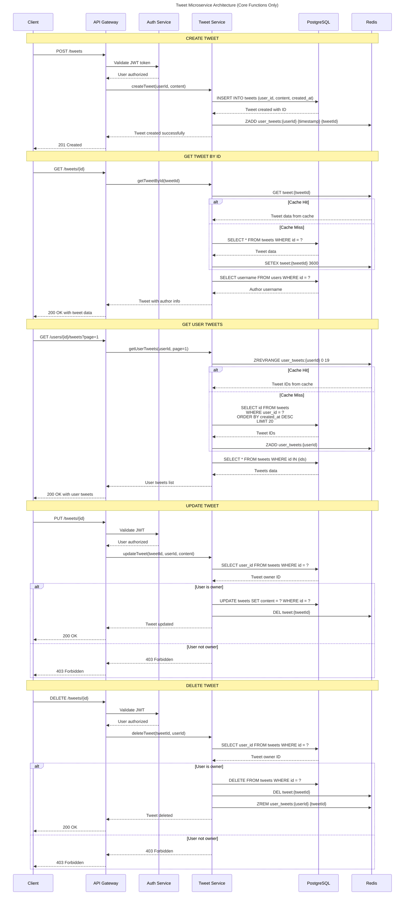

# Тестовый микросервис твитов(в разработке)

```mermaid
sequenceDiagram
    title Tweet Microservice Architecture (Core Functions Only)

    participant User as Client
    participant Gateway as API Gateway
    participant Auth as Auth Service
    participant TweetService as Tweet Service
    participant PostgreSQL as PostgreSQL
    participant Redis as Redis

    %% Create Tweet Flow
    Note over User, Redis: CREATE TWEET
    User->>Gateway: POST /tweets
    Gateway->>Auth: Validate JWT token
    Auth-->>Gateway: User authorized
    Gateway->>TweetService: createTweet(userId, content)
    
    TweetService->>PostgreSQL: INSERT INTO tweets (user_id, content, created_at)
    PostgreSQL-->>TweetService: Tweet created with ID
    
    TweetService->>Redis: ZADD user_tweets:{userId} {timestamp} {tweetId}
    TweetService-->>Gateway: Tweet created successfully
    Gateway-->>User: 201 Created

    %% Get Tweet by ID Flow
    Note over User, Redis: GET TWEET BY ID
    User->>Gateway: GET /tweets/{id}
    Gateway->>TweetService: getTweetById(tweetId)
    
    TweetService->>Redis: GET tweet:{tweetId}
    alt Cache Hit
        Redis-->>TweetService: Tweet data from cache
    else Cache Miss
        TweetService->>PostgreSQL: SELECT * FROM tweets WHERE id = ?
        PostgreSQL-->>TweetService: Tweet data
        TweetService->>Redis: SETEX tweet:{tweetId} 3600
    end
    
    TweetService->>PostgreSQL: SELECT username FROM users WHERE id = ?
    PostgreSQL-->>TweetService: Author username
    TweetService-->>Gateway: Tweet with author info
    Gateway-->>User: 200 OK with tweet data

    %% Get User Tweets Flow
    Note over User, Redis: GET USER TWEETS
    User->>Gateway: GET /users/{id}/tweets?page=1
    Gateway->>TweetService: getUserTweets(userId, page=1)
    
    TweetService->>Redis: ZREVRANGE user_tweets:{userId} 0 19
    alt Cache Hit
        Redis-->>TweetService: Tweet IDs from cache
    else Cache Miss
        TweetService->>PostgreSQL: SELECT id FROM tweets<br/>WHERE user_id = ?<br/>ORDER BY created_at DESC<br/>LIMIT 20
        PostgreSQL-->>TweetService: Tweet IDs
        TweetService->>Redis: ZADD user_tweets:{userId}
    end
    
    TweetService->>PostgreSQL: SELECT * FROM tweets WHERE id IN (ids)
    PostgreSQL-->>TweetService: Tweets data
    TweetService-->>Gateway: User tweets list
    Gateway-->>User: 200 OK with user tweets

    %% Update Tweet Flow
    Note over User, Redis: UPDATE TWEET
    User->>Gateway: PUT /tweets/{id}
    Gateway->>Auth: Validate JWT
    Auth-->>Gateway: User authorized
    Gateway->>TweetService: updateTweet(tweetId, userId, content)
    
    TweetService->>PostgreSQL: SELECT user_id FROM tweets WHERE id = ?
    PostgreSQL-->>TweetService: Tweet owner ID
    alt User is owner
        TweetService->>PostgreSQL: UPDATE tweets SET content = ? WHERE id = ?
        TweetService->>Redis: DEL tweet:{tweetId}
        TweetService-->>Gateway: Tweet updated
        Gateway-->>User: 200 OK
    else User not owner
        TweetService-->>Gateway: 403 Forbidden
        Gateway-->>User: 403 Forbidden
    end

    %% Delete Tweet Flow
    Note over User, Redis: DELETE TWEET
    User->>Gateway: DELETE /tweets/{id}
    Gateway->>Auth: Validate JWT
    Auth-->>Gateway: User authorized
    Gateway->>TweetService: deleteTweet(tweetId, userId)
    
    TweetService->>PostgreSQL: SELECT user_id FROM tweets WHERE id = ?
    PostgreSQL-->>TweetService: Tweet owner ID
    alt User is owner
        TweetService->>PostgreSQL: DELETE FROM tweets WHERE id = ?
        TweetService->>Redis: DEL tweet:{tweetId}
        TweetService->>Redis: ZREM user_tweets:{userId} {tweetId}
        TweetService-->>Gateway: Tweet deleted
        Gateway-->>User: 200 OK
    else User not owner
        TweetService-->>Gateway: 403 Forbidden
        Gateway-->>User: 403 Forbidden
    end
```